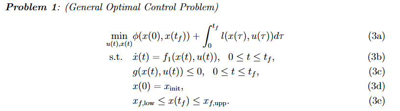
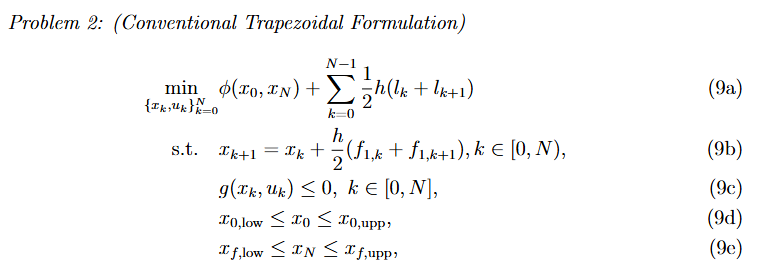

# Trajectory Optimization Examples
This repo contains some simple Matlab implimentations for solving continous-time 
trajectory optimziation problems with Casadi. The basic idea is using discretization 
techniques (direct collocation, multi shooting) to discrete the continous-time 
optimal control problems into a discrete-time nonlinear programming, and solve them 
with NLP solvers. Some important notes can be found [here](## Learn more about trajectory optimimization)

## Basic idea on Trajectory Optimization
Mathematically speaking, the trajectory optimimization can be formulated as 
a continous-time optimal control problem as follow


where x(t) is the state trajectory and u(t) is the control trajectory. We 
aim to find the best state and control trajectory by minimizing the obejctive 
while satisfying all constraints.

The key idea of the discretization techniques is to convert the orignal 
continuous-time optimization problems to a discrete-time one, such that NLP 
solvers can solve that. 


To know more about trajectory optimization, we recommend 
the following great materials:


1. [Introduction to trajectory optimization (SIAM Review 2017)](https://epubs.siam.org/doi/10.1137/16m1062569);
2. [Model Predictive Control: Theory, Computation, and Design (By Rawlings, James Blake, David Q. Mayne, and Moritz Diehl)](https://sites.engineering.ucsb.edu/~jbraw/mpc/)

## Usage
1. download casadi from [here](https://web.casadi.org/get/)
2. Modify addpath on casadi in setup.m
3. Run setup.m
4. Run demo.m

Check folder `examples` for more examples.
1. Cartpole
2. Arcbot
3. Five link biped
4. 1D quadrotor
5. 2D quadrotor


## Learn more about trajectory optimimization
* We have two strategies solving the original continuous-time optimal control, one is "discrete first and optimize"(this repo), another is "optimize first and discrete". With the fast development of optimization techniques, the first strategy becomes much popular in robotic commnunity. You can also check following classic materials to have a comprehensive understanding of trajectory optimization.
 1. [Practical Methods for Optimal Control Using Nonlinear Programming](https://epubs.siam.org/doi/book/10.1137/1.9781611976199)
* Discretization is just the first step for trajectory optimization, we stil have lots of things can do. If you are intereting in this topic, the following materials are quite useful.
  1. Speed up the optimization:
     1. [Accelerating Numerical Methods for Optimal Control](https://www.ri.cmu.edu/publications/accelerating-numerical-methods-for-optimal-control/) by Brian E. Jackson (CMU, 2022)
     2. [OCS2](https://leggedrobotics.github.io/ocs2/) by RSL (ETH, 202X)
  2. Differentiable Contact Constraints:
     1. [Numerical optimization for things that move : simulation, planning, and control](https://searchworks.stanford.edu/view/14423038) by Taylor Athaniel Howell (Stanford, 2022)
  3. Hybrid systems
  4. Stochastic dynamics 
     1. [Applied Stochastic Differential Equations](https://users.aalto.fi/~asolin/sde-book/sde-book.pdf)


If you find this work useful, please consider citing our paper:

```
@INPROCEEDINGS{Tang-ECC,
  author={Tang, Jiawei and Zhong, Yuxing and Wang, Pengyu and Chen, Xingzhou and Wu, Shuang and Shi, Ling},
  booktitle={2024 European Control Conference (ECC)}, 
  title={Direct Shooting Method for Numerical Optimal Control: A Modified Transcription Approach}, 
  year={2024},
  volume={},
  number={},
  pages={3150-3155},
  keywords={Upper bound;Accuracy;System dynamics;Optimal control;Europe;Programming;Benchmark testing},
  doi={10.23919/ECC64448.2024.10590900}}
  ```
   
